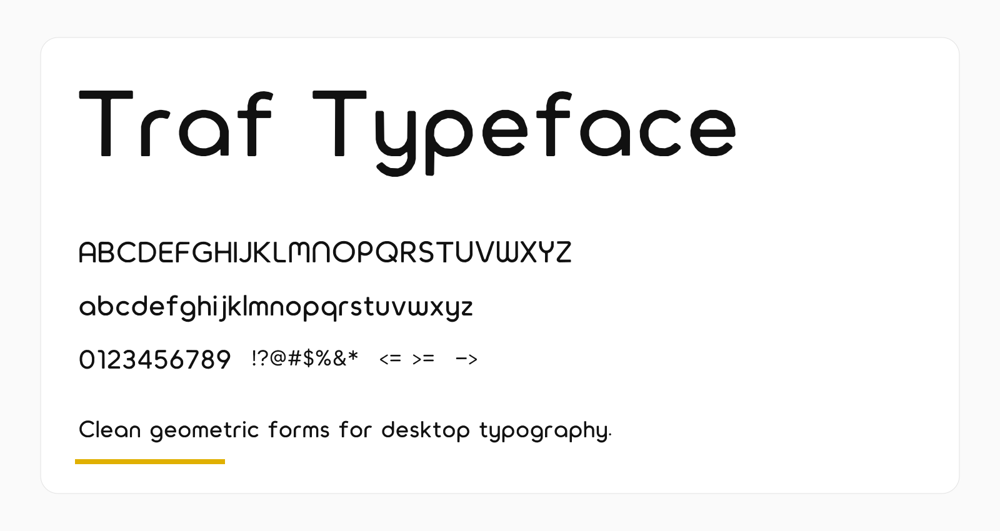

# Traf Typeface



Traf Typeface is a geometric Latin typeface developed from the `Traf` lettering used in the Unknown / Traf visual identity. It is intended for desktop UI, branding, headings, compact documentation, and other interface-oriented typography while remaining readable in ordinary English text.

## Current scope

- Regular static TrueType font
- UFO source in `sources/Traf-Regular.ufo`
- GF Latin Core encoded character coverage
- Extended Latin, punctuation, fractions, math, arrows, and currency symbols
- Proportional default figures plus `tnum` tabular alternates
- SIL Open Font License 1.1

## Building

```bash
python -m venv venv
. venv/bin/activate
pip install -r requirements.txt
make build
```

The output is copied to `fonts/ttf/`.

## QA

```bash
make test
```

The GitHub Actions workflow also builds the font and runs the Google Fonts FontBakery profile on pushes and pull requests.

## Google Fonts status

The repository is structured for Google Fonts upstream development: source files are in `sources/`, the build is one-step and open-source, and the font targets GF Latin Core. The public upstream repository is `yannickfan67-ai/Traf-Typeface`. Before an actual Google Fonts onboarding issue is filed, the legal author/contact placeholders in `AUTHORS.txt` and `CONTRIBUTORS.txt` still need to be replaced with the final maintainer credits.

## Design notes

The core style uses rounded geometric construction, restrained stroke contrast, and unusual `m`, `w`, `n`, `u`, and `r` forms inherited from the original Traf lettering. The font is designed primarily for PC/desktop use; web use is possible but not the design's primary constraint.

## License

Traf Typeface is licensed under the SIL Open Font License, Version 1.1. See `OFL.txt`.

## Upstream

https://github.com/yannickfan67-ai/Traf-Typeface
